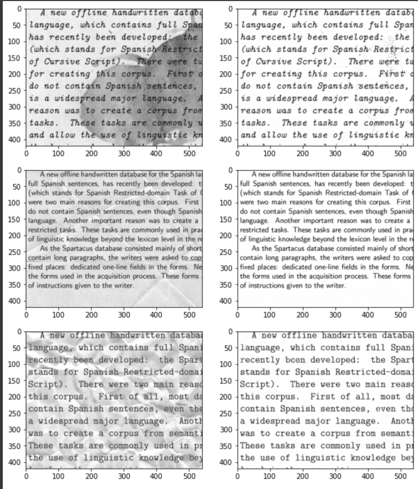

# AutoEncoders-Image_Denoising_Restructuring

In this notebook, we are trying to perform autoencoding on a set of text excerpts which contain background noise, and we are training the model to re-generate the text along with de-noising the image.

